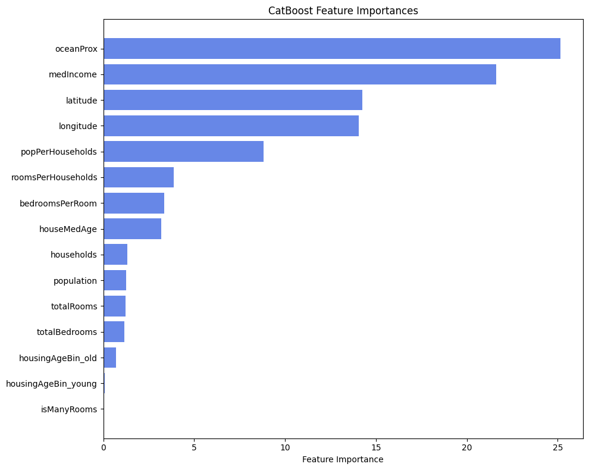
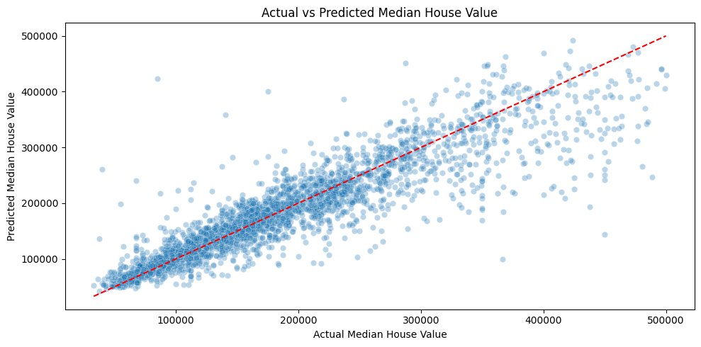

# 🏠 California Housing Price Prediction

Capstone Project – Purwadhika JCDS 3004-009 (Module 3: Machine Learning)
Author: **Bonifasius Sinurat**

---

## Overview

This project builds a **machine learning model** to predict the **median house price** in California using the 1990 census dataset.
Beyond accuracy, the project translates predictions into **business actions**: ROI analysis, negotiation range, and key price drivers for decision makers.

**Stakeholders:** Chief Marketing Officer (CMO) & Sales Director
**Goal:** Reliable pricing support for faster decisions and better margins.

---

## Repository Structure

- **California House/** – dataset (CSV)
- **catboost_info/** – CatBoost training logs (optional)
- **png/** – images used in docs/README
  - actual_vs_predicted.png
  - feature_importances.png
  - pipeline.png
- **app.py** – Streamlit app
- **CA_housing_price_regressor.sav** – trained model (pickle)
- **California Housing Price Prediction.pdf** – slides
- **capstone_m3_machine_learning.ipynb** – main notebook
- **requirements.txt** – dependencies (or `requirements`)
- **runtime.txt** – Python version for Streamlit (e.g., 3.11)

---

## Dataset

- **Source:** Pace & Barry (1997), California Housing (1990 Census)
- **Rows:** 14,448 districts
- **Target:** `median_house_value`
- **Features:** 9 numerical + 1 categorical (`oceanProx`)
- **Notes:**
  - Censoring at **$500,001** for high-end prices
  - `medIncome` is recorded in **tens of thousands USD** (e.g., 3.5 → $35,000)

---

## Methodology

### Preprocessing & Feature Engineering

- Missing values: **KNNImputer** (137 NaNs)
- Outliers: **Winsorizer (Gaussian, fold 2.5)**
- Scaling: **RobustScaler**
- Encoding: **Binary / Ordinal / One-Hot**
- Target transform: **log ↔ exp** (via `TransformedTargetRegressor`)
- New features:
  - `roomsPerHouseholds`, `bedroomsPerRoom`, `popPerHouseholds`
  - `isManyRooms` (rooms > 95th percentile)
  - `housingAgeBin` (young/middle/old)

### Models Evaluated

Linear, Ridge, Lasso, KNN, Decision Tree, Random Forest, XGBoost, **CatBoost**

**Best Model – CatBoost**

- MAE: **$27,533**
- MAPE: **14.97%** (meets ≤ 15% target)
- RMSLE: **0.2113**

**Top Drivers (Feature Importance)**

1. Ocean Proximity (~25.1%)
2. Median Income (~21.6%)
3. Latitude (~14%)
4. Longitude (~14%)

---

## Visuals

**Pipeline**


**Feature Importance**


**Actual vs Predicted**


---

## Business Insights


- **Negotiation Anchor (around a $260,000 prediction)**
  - MAE-based range: **$232,467 – $287,533**
- **ROI Check (example setup)**
  Total investment: **$236,000** (purchase + renovation)
  Selling fee: **6%**
  ROI target: **≥ 10%**
  → **No Deal Below:** **$276,170**

---

## How to Run (Local)

1. Install dependencies:

   ```bash
   pip install -r requirements.txt
   ```
2. Run the notebook:

   Open `capstone_m3_machine_learning.ipynb` in Jupyter/VS Code and run all cells.
3. Run the Streamlit app:

   ```
   streamlit run app/app.py
   ```


## Limitations & Next Steps

* Error grows on luxury/high-end prices due to censoring and limited samples
* Add geospatial signals (distance to coast/city center/POIs)
* Expand high-end segment coverage
* Consider **quantile regression** / **conformal prediction** for price intervals
* Regular  **retraining & validation** ; use **SHAP** for explainability

---

## Deployment

This repo includes `runtime.txt` (e.g., `3.11`) for Streamlit Cloud.

**Live App:** *coming soon*

---

## License

Educational use for **Purwadhika Module 3 – Machine Learning** capstone project.

For other uses, please provide proper attribution.
